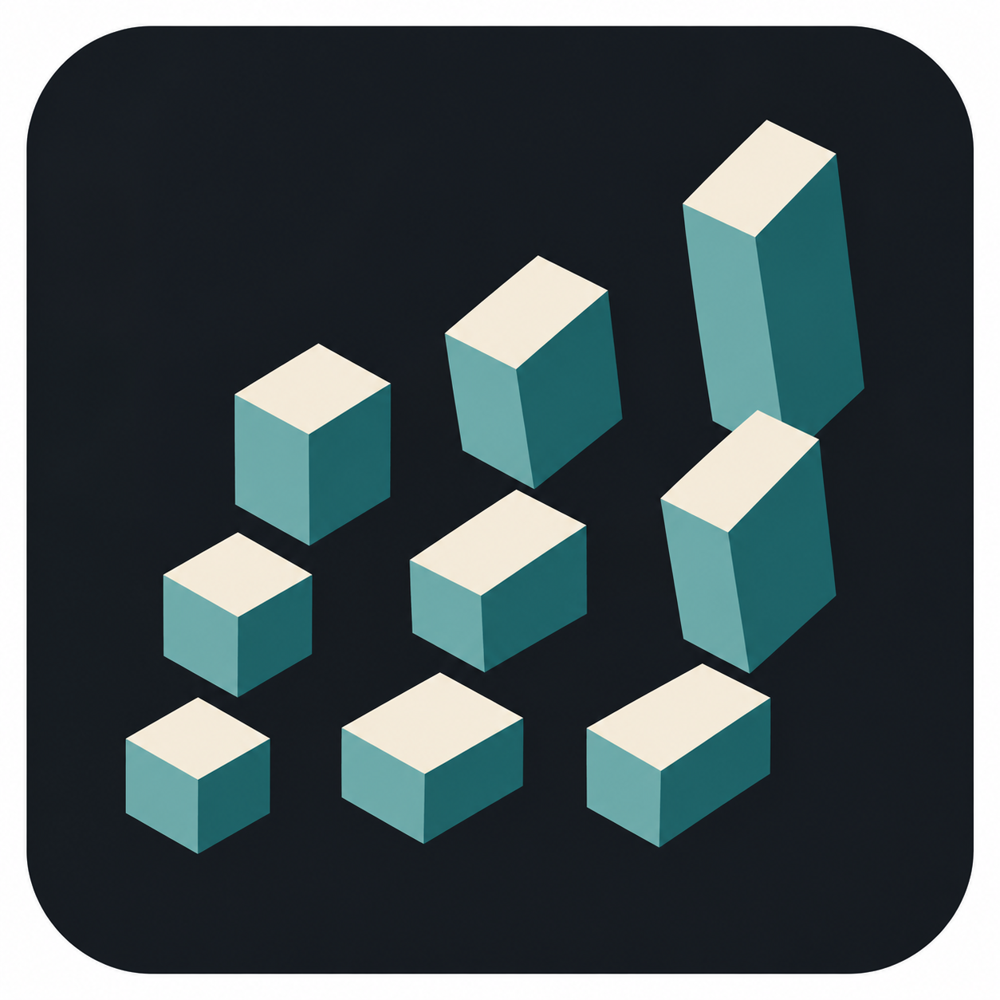

# Array Studio

Variation-driven array tools for Rhino 8 on Windows and macOS. Array Studio adds
shift, rotation, scale, random and gradual variation, and spatial falloff to four
common architectural array workflows.

**Current release:** 0.9.0 · **Command:** `ArrayStudio` · **License:** MIT

## Install and launch

1. In Rhino 8, run `PackageManager`.
2. Search for `ArrayStudio` and choose **Install**.
3. Restart Rhino when prompted.
4. Run the `ArrayStudio` command.

No Git checkout, IDE, separate Python installation, or external dependency is
required. Rhino supplies Python 3, RhinoCommon, rhinoscriptsyntax, and Eto.

## Choose an array tool

| Tool | Use it for |
| --- | --- |
| **Profile Array** | Aggregate curves in a linear or construction-plane grid arrangement. |
| **Along Curve** | Place curves, polysurfaces, groups, or blocks along a planar or 3D path. |
| **Surface Array** | Place sources at trim-aware U/V samples on a surface or polysurface face. |
| **Volume Array** | Switch between samples on exterior faces and a grid inside a closed volume. |

Every tool has **All array tools** to return to the chooser. Closing the chooser
returns to the panel you came from.

## Create an array

1. Select the source geometry. Curves, polysurfaces, groups, and block instances
   can be used as one repeated unit.
2. Pick a base point if the source bounding-box center is not appropriate.
3. For Along Curve, Surface, or Volume, select the target geometry.
4. Set counts and placement options.
5. Choose **Random** or **Gradual** variation and adjust Shift, Rotate, or Scale.
6. Optionally enable **Falloff**, pick its center, and set its radius, strength,
   and softness.
7. Inspect the temporary preview, then choose **Create array**.

Choose **Wireframe** or **Shaded** preview and use **Color** to make the preview
easy to read. Preview appearance does not change the generated objects. Canceling
clears the preview, and each completed array can be removed with one Undo.

Blocks remain instances. Grouped sources move together, and every multi-object
copy receives its own group. Array Studio preserves the originals and selects the
new output.

## Variation behavior

- **Random** samples values between minimum and maximum limits. The same seed and
  settings reproduce an arrangement; **New random arrangement** changes the seed.
- **Gradual** interpolates from start to end along curve order, surface U/V, or a
  selected spatial axis in a volume.
- **Falloff** blends shift and rotation toward zero and scale toward one outside
  its zone. It changes variation strength without removing copies.
- **Uniform scale** uses one scale value on all axes. Turn it off for independent
  X, Y, and Z scaling.

## Current scope

- Curve copies use a count distributed along path length. Distance-based spacing
  is not included yet. Closed curves omit the duplicate seam endpoint.
- Surface and exterior counts are U/V samples per face. Physical spacing can be
  uneven, especially on curved or irregular surfaces, and trimmed areas reduce
  the final count.
- Interior arrays require a closed manifold polysurface. Containment applies to
  nominal base points; varied objects can overlap or extend outside the target.
  Array Studio is not a collision-free packing tool.
- A maximum of 5,000 candidate placements is enforced. Large previews are sampled,
  while creation uses all valid placements.
- Reselect source or target geometry after editing it in Rhino.

Problems and reproducible examples are welcome in the
[issue tracker](https://github.com/KnuckKnuck0123/ArrayStudio/issues).

## Development

Clone the standalone repository and open its root folder in VS Code or a compatible
IDE:

```sh
git clone https://github.com/KnuckKnuck0123/ArrayStudio.git
cd ArrayStudio
```

Open Rhino 8, run `StartScriptServer`, then open `src/ArrayTools.py` in the IDE.
Press **Ctrl+Shift+B** on Windows or **Cmd+Shift+B** on macOS. The workspace task
sends the active saved script to Rhino with `rhinocode script`; use
`src/TestConnection.py` for a harmless connection check.

The development launcher reloads implementation modules between runs. The
published command entry is `src/ArrayStudio.py`, and the shared implementation is
under `src/array_tools/`. Detailed architecture, setup, and release notes are in
[Development](docs/DEVELOPMENT.md). Manual Rhino coverage is in
[Testing](docs/TESTING.md), and feature intent is in [Design](DESIGN.md).

Run the standalone variation checks with:

```sh
python3 -m unittest discover -s tests -p 'test_*.py'
```

The `tests/rhino_*.py` checks run inside Rhino. To build the cross-platform Rhino
8 package on macOS:

```sh
sh scripts/build_package.sh
```

`ArrayStudio.rhproj` produces one `ArrayStudio` Rhino command. Release artifacts
are written below `build/package/rh8/` and are intentionally excluded from Git.

## License

Array Studio is available under the [MIT License](LICENSE).
